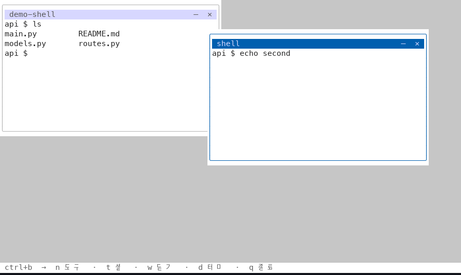

# polycanv

> ⚠️ 초기 개발 중. macOS 에서 개발·확인하고 있고, 리눅스는 동작할 것으로 보지만 확인 전이며,
> 윈도우는 아직 안 된다(아래 참고).

**English: [README.md](README.md)**

작업하던 세션은 흩어진다. 여기 창 하나, 저기 탭 하나, 또 하나는 창 세 개 뒤에 묻힌다.
막상 그 세션을 보려면 찾아다녀야 한다.

polycanv 는 그것들을 **한 캔버스**에 모은다. 각 터미널이 내가 놓은 자리에, 내가 정한
크기로, 그대로 있는다.


*목록에서 도구를 골라 열고, 끌어다 놓고, 크기를 바꾼다.*

## 어떻게 쓰나

- **타일링이 아니라 캔버스.** 터미널마다 제목 표시줄이 있다. 그걸 끌면 창이 움직이고,
  오른쪽 끝의 버튼으로 접거나 닫는다. 오른쪽 아래 모서리를 끌면 크기가 바뀐다.
  겹쳐 놓을 수 있고, 놓아둔 자리에 그대로 있는다.
- **본문은 터미널의 것이다.** 끌어서 글자를 고르고 `Cmd+C` 로 복사한다. `Ctrl+C` 는
  안쪽 프로그램에 가서 도는 에이전트를 끊는다. 휠은 지나간 출력을 되돌아보고,
  안쪽 프로그램이 마우스를 원하면(claude code·vim) 그쪽으로 넘긴다.
- **`Ctrl+b` 다음 한 글자** — `n` 도구 목록, `t` 셸, `w` 닫기, `q` 종료. 나머지 키는 전부
  안에서 도는 프로그램의 것이다. `Ctrl+c`, `Ctrl+w`, 화살표가 원래 뜻대로 동작한다.
  `Ctrl+b` 를 두 번 누르면 그 키 자체가 안으로 전달된다.
- **밝게도 어둡게도.** `Ctrl+b d` 로 바꾸고, 고른 것은 기억한다. 이번 실행만 바꾸려면
  `--theme light`.
- **도구 목록은 설정 파일에.** 첫 실행에 `~/.config/polycanv/tools.toml` 이 만들어진다
  (claude code, codex, opencode, qwen, 셸). 자기 CLI 를 한 줄 적어 넣으면 내장 도구와
  똑같이 동작한다.

## 설치

명령 하나. 멀티플렉서도, 툴체인도 먼저 깔 필요 없다.

```sh
uv tool install polycanv
polycanv
```

Python 3.10 이상이 필요하고, 없으면 `uv` 가 받아 준다.

> **아직 유닉스 전용.** 터미널을 `pty` 로 다루는데 윈도우에는 그게 없다. WSL 은 된다.

### 밝은 테마



캔버스가 반드시 드러내야 하는 정보는 **지금 어느 터미널을 보고 있는가** 하나다.
그래서 색은 거기에만 쓴다 — 포커스된 창의 제목 줄. 나머지는 조용히 둔다.
빨강·노랑·초록은 일부러 비워 뒀다. 신호등이 쓸 자리다.

### 브라우저로 열기

WSL·원격 기계처럼 터미널 에뮬레이터가 마땅치 않은 곳에서 쓴다.

```sh
uv tool install --force 'polycanv[web]'
polycanv --web            # http://127.0.0.1:8000
polycanv --web --port 9000
```

8000 은 흔히 쓰이는 포트다. 막혀 있으면 옆의 빈 번호로 옮기고 어디로 갔는지 알려준다.
다만 포트를 콕 집어 말했는데 막혀 있으면 **말없이 옮기지 않고** 그렇다고 알린다 —
그 주소로 접속하려던 것이기 때문이다.

**`127.0.0.1` 에만 붙고, 그걸 바꾸는 선택지를 두지 않았다.** polycanv 를 HTTP 로 여는 것은
셸을 여는 것이고 아직 인증이 없다. 다른 기계에서 쓰려면 SSH 로 포트를 넘겨라 —
`ssh -L 8000:127.0.0.1:8000 you@box` — 그러면 인증이 있어야 할 자리에 남는다.

### 더 넓게 보기

터미널은 글자 크기를 못 바꾸므로 polycanv 에는 자체 축소가 없다 — 대신 **터미널이 이미
해 준다.** `Cmd+-` 로 글꼴을 줄이면 행·열이 늘고, 그만큼 패널이 더 들어온다. 브라우저에서도
같은 단축키가 되고, 주소에 `?fontsize=8` 을 붙이면 처음부터 작게 열 수 있다.

## 도구 설정

```toml
[[tool]]
name = "claude"
command = ["claude"]

[[tool]]
name = "api server"
command = ["bash", "-lc", "npm run dev"]
cwd = "~/work/api"
```

설치되지 않은 도구도 목록에 **표시해서 보여준다** — "polycanv 가 못 찾는 것"과
"polycanv 가 지원하지 않는 것"을 구분할 수 있어야 하기 때문이다.

## 앞으로

[이슈](https://github.com/maengyo/polycanv/issues)와
[프로젝트 보드](https://github.com/users/maengyo/projects/1)에서 관리한다.

- **신호등** — 🟢 도는 중 / 🟡 나를 기다림 / 🔴 끝남 / ⚪ 쉬는 중 을 터미널 테두리에.
  네 CLI 의 상태 전달 방식은 이미 측정해
  [`docs/research/cli-status-hooks.md`](docs/research/cli-status-hooks.md) 에 적어 뒀고,
  감지 자체는 아직 안 만들었다.
- **묶어 보기** — 같은 디렉터리에서 도는 터미널들이 한 덩어리로 읽히게.
- **세션 유지** — 껐다 켜도 놓아둔 배치 그대로.
- **브라우저로 열기** — WSL·원격용. `127.0.0.1` 에만 붙인다.

## 개념의 출처

컨셉은 **[cate](https://github.com/0-AI-UG/cate)** 에서 왔다 — *병렬로 도는 코딩
에이전트를 위한 무한 캔버스 IDE*. cate 는 캔버스를 관제탑으로 쓴다. 터미널마다 에이전트가
일하는 중인지 끝났는지 나를 기다리는지 보이고, git worktree 마다 자기 색의 영역을 가져서
브랜치 다섯 개의 에이전트 다섯이 탭 무더기가 아니라 다섯 갈래 작업으로 읽힌다.

polycanv 는 그 생각을 터미널로 가져온 것이다. 전제는 같고 — **세션에는 탭 번호가 아니라
자리가 필요하다** — 범위는 일부러 좁혔다. 에디터도, 브라우저도, 데스크톱 앱도 없다.
공간형 IDE 전체가 필요하면 cate 를 쓰는 게 맞다. 그쪽이 더 풍부한 도구다.

## 구조

```
src/polycanv/
  app.py        본체: 접두키와 동작
  canvas.py     터미널이 놓이는 바닥
  terminal.py   터미널 하나: PTY, 화면 상태, 이동과 크기 조절
  launcher.py   도구 고르기
  tools.py      tools.toml 읽기
  keymap.py     키 → 터미널이 기대하는 바이트
  keys.py       앱이 가져가는 키와, 왜 그것뿐인지
scripts/dev/    데모 녹화, 화면 캡처 검증 도구
docs/           연구 기록, 날짜별 작업 기록, 데모 스크립트
```

## 지금 상태

된 것: 캔버스, 옮기고 크기 바꾸는 터미널, 도구 목록, 안쪽 프로그램에 키를 남겨 두는 키 처리.

안 된 것: 위 **앞으로** 항목 전부. 설계 판단과 그 근거는 `CLAUDE.md`, 날짜별 기록은
`docs/worklog.md` 에 있다. **틀린 것으로 드러난 가정도 함께 남겨 둔다** — 왜 그렇게
정했는지는 그 결정보다 오래 남는다.

## 라이선스

[MIT](LICENSE)
